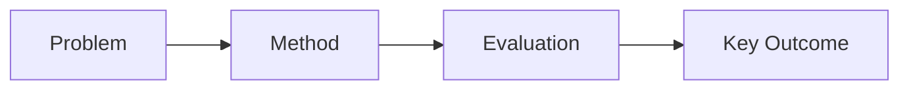
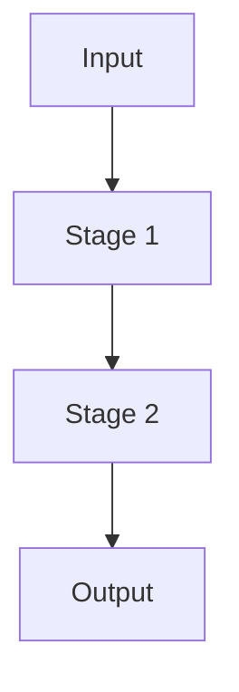
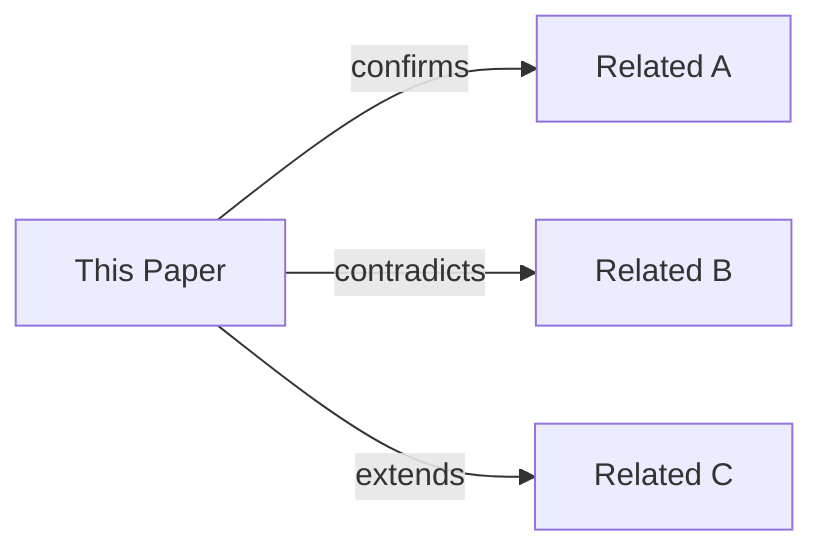

# {{TITLE}}

> 分析立场：怀疑精神，以证据为中心。下文所有判断均需附精确锚点（`[Section x.y]`、`[Figure n]`、`[Table n]`）。陈述事实与表达判断须明确区分。

## 1. Executive Summary + Visual Abstract

用自然段落写出以下核心信息，不要逐条问答：

- **最终判断**：2-4 句话，用非专业读者也能理解的语言，说清楚这篇论文到底做了什么、是否值得关注。
- **决策背景**：这份分析服务于什么决策场景（是否跟进复现？是否采用该方法？是否作为基线对比？）。
- **核心问题与实质改进**：这篇论文试图解决什么问题，为什么现在值得关注，它是否带来了实质性改进——用具体的量化证据支撑，不要复述论文摘要。
- 最后给出一段约 100 字的要点概述（tl;dr），让时间有限的读者快速抓住要点。



每张图必须附带：图注（概括图中内容）和解读（读者应从中得出的分析结论）。

## 2. Problem Definition

### 2.1 Essence

用自然语言讲清楚"这篇论文到底在解决什么问题"。避免术语堆砌，让非该子领域的 CS 研究者也能理解。

关注以下维度（自由组织，不必逐条问答）：

- 核心问题是什么，为什么过去的方法没解决——写根因而非表面现象。
- 真正的瓶颈在哪里（算力/内存/数据/优化目标/部署约束）。
- 这个问题在实践中难在何处，有哪些适用边界（什么场景下不适用）。
- 如果不解决，实际代价是什么。

### 2.2 Formal Definition

如果论文给出了严格形式化定义，在此复述并解释每个符号的含义。如果论文没有给出，则用"准形式化"方式自行整理：写清输入、输出、目标函数、约束条件和成功标准。

$$
\text{(论文中的目标函数或约束条件)}
$$

| Symbol | Meaning | Unit / Type | Notes |
| ------ | ------- | ----------- | ----- |
|        |         |             |       |

至少需要覆盖：任务类型、输入 $x$、输出 $y$、优化目标、关键约束、前提假设。

## 3. Method + Experimental Credibility

### 3.1 Method Mechanism

用 3-6 个具体步骤描述方法的核心机制（输入 → 处理 → 输出），禁用论文自身的营销语言。重点区分：

- **真正的新东西** vs 旧模块的重新组合。
- **主要贡献组件**（去掉它性能会显著下降的部分）vs 辅助组件。
- 该方法做了什么取舍（如准确率 vs 时延，通用性 vs 领域特化）。
- 为什么旧方法做不到而这个方法可能做到——给出机制层面的解释，而非性能数字。



图注和解读：标注哪一阶段最关键及其原因。

**关键伪代码**（算法类论文必填；非算法类论文标注 `N/A` 并说明原因）：

```
Algorithm: <算法名称>              # 对应原文章节/Figure/Algorithm 编号
Input:  <输入及其类型>
Output: <输出及其类型>

1:  <步骤>
2:  for <条件> do
3:      <步骤>                    # ← 标注最关键操作
4:  end for
5:  return <输出>
```

伪代码之后用自然段落说明：最关键的操作（哪一步决定了方法的核心特性）、时间复杂度（$O(\cdot)$，说明主导项来源）、空间复杂度（$O(\cdot)$，说明主要占用来源）。

### 3.2 Experimental Credibility

评估实验设计是否可信。关注以下维度：

- 数据集与划分是否代表真实使用场景。
- 基线是否强且公平——考虑调参力度、计算预算、模型规模是否对等。
- 评估指标是否真正匹配论文声称要解决的问题。
- 硬件与时延比较是否在同等或可比设置下进行。
- 统计可靠性：是否有多次运行的方差报告、随机种子说明、置信区间或显著性检验。
- 本实验最大的有效性威胁是什么（内部/外部/构念效度）。

| Dataset/Benchmark | Split | Metric | Why it matters | Mismatch risk |
| ----------------- | ----- | ------ | -------------- | ------------- |
|                   |       |        |                |               |

## 4. Results, Boundaries, Anti-Packaging

### 4.1 Claim Verification

逐条列出论文的核心声称，给出验证结论和量化证据锚点。

| Claim ID | 论文声称（用自己的话） | Verdict                           | Quant evidence | Anchor                                 |
| -------- | ---------------------- | --------------------------------- | -------------- | -------------------------------------- |
| C1       |                        | Supported / Partial / Unsupported |                | [Table n] / [Figure n] / [Section x.y] |

用一张汇总表对比主要方法的指标与代价：

| Method | Main Metric | Δ   | Cost/Latency/Memory | Notes |
| ------ | ----------- | --- | ------------------- | ----- |
|        |             |     |                     |       |

在此嵌入论文的核心结果图（如消融实验、主对比表等），并附分析：


图注和解读：展示的对比类型，方法提升了什么、为此付出了什么代价。

### 4.2 Boundary and Failure Profile

**必须包含本节，不得只有正面结论。** 关注：

- 在什么具体条件下性能会下降（给出论文中报告或你推断的触发条件）。
- 对哪些因素敏感（超参数范围、数据分布偏移、随机种子等）。
- 具体的失败案例或边界条件——论文中是否展示了失败样本？如果没有，明确指出这一缺失。
- 隐性工程成本：部署复杂度、调参负担、对基础设施的要求、训练/推理成本是否在可控范围。
- 用户不应对该方法抱有哪些不切实际的预期。

| Failure Scenario | Trigger Condition | Observed Behavior | Practical Impact | Mitigation |
| ---------------- | ----------------- | ----------------- | ---------------- | ---------- |
|                  |                   |                   |                  |            |

### 4.3 Anti-Packaging

去包装化分析——剥离论文的营销语言，还原事实：

- 发现的夸大表述（引用原文 + 你的纠正）。
- 基线缺失或过弱：有哪些应对比但未对比的方法？对比是否公平？
- 选择性汇报：论文展示了哪些结果，又省略了哪些本该展示的结果？
- 声称"创新"但实为渐进改进的部分。
- 去包装后的结论：用一段话说明，去掉所有宣传用语后，这篇论文仍然成立的事实是什么。

## 5. Cross-Paper Impact + Inspiration + Action

### 5.1 Cross-Paper Relation

本节回答：与我们已有认知中的其他论文相比，哪些结论被强化、推翻或改写。

引用要求：每条涉及的论文必须给出完整引用，不可只写标题缩写。表格中的路径用于本地定位，完整书目信息在附录 A 中以 `[Ref-编号]` 对应。

| Related paper | Ref      | Relation                                      | What changes in our understanding |
| ------------- | -------- | --------------------------------------------- | --------------------------------- |
|               | [Ref-01] | confirm / contradict / supersede / orthogonal |                                   |



### 5.2 Impacted Existing Reports

如果这份新分析让之前某份报告中的结论需要更新，在此记录：

| Impacted report | Change type                  | Statement to update | Reason and new evidence |
| --------------- | ---------------------------- | ------------------- | ----------------------- |
|                 | minor patch / major revision |                     |                         |

### 5.3 科研启发与跨领域类比

核心驱动问题：**这个问题的本质结构在其他领域是否已有成熟解法？**

#### 跨领域类比

将核心问题结构剥离 CS 术语后，在以下领域中搜索类比解法（选相关性最高的 2-3 个领域展开）：

- 生物/神经科学（记忆整合、突触可塑性、免疫克隆选择、进化算法）
- 物理/信息论（熵最小化、压缩感知、相变、退火）
- 认知科学/心理学（双系统决策、注意力机制、工作记忆容量约束）
- 经济学/博弈论（机制设计、拍卖理论、信息不对称激励）
- 控制论/工程学（反馈控制、卡尔曼滤波、自适应控制、冗余设计）

| 本论文问题结构 | 类比领域 | 已有解法参照 | 迁移可行性   |
| -------------- | -------- | ------------ | ------------ |
|                |          |              | 低 / 中 / 高 |

#### 潜在改进路径（2-4 条）

基于上述跨领域类比，提出具体可操作的改进方向：

| #   | 灵感来源 | 迁移机制 | 预期解决的局限 | 验证难度     |
| --- | -------- | -------- | -------------- | ------------ |
| 1   |          |          |                | 低 / 中 / 高 |

### 5.4 Actionable Next Steps

基于本次分析，给出具体行动建议：

- 立即可采用的低风险、高置信结论。
- 需要小规模受控实验验证的假设（先验证什么，怎么验证）。
- 暂缓采用的建议及其原因和重新评估的触发条件。

### 5.5 推荐阅读

为读者提供"下一步读什么"的路线图。先提炼关键词再构造检索式，覆盖以下 4 类（每类至少 2 篇）：

| 类别          | 推荐论文 | Ref      | 推荐理由 | 关系     |
| ------------- | -------- | -------- | -------- | -------- |
| 近 2 年同题   |          | [Ref-10] |          | 同题     |
| 近 2 年同题   |          | [Ref-11] |          | 同题     |
| 本文基线      |          | [Ref-12] |          | 基线     |
| 本文基线      |          | [Ref-13] |          | 基线     |
| 本文改进对象  |          | [Ref-14] |          | 改进对象 |
| 本文改进对象  |          | [Ref-15] |          | 改进对象 |
| 本文批评/局限 |          | [Ref-16] |          | 被批评   |
| 本文批评/局限 |          | [Ref-17] |          | 被批评   |

关键词和检索式：

- 问题关键词：
- 方法关键词：
- 约束关键词：
- 对比关键词：

| 数据源         | 查询语句 | 时间过滤 | 备注 |
| -------------- | -------- | -------- | ---- |
| Google Scholar |          |          |      |
| DBLP           |          |          |      |

## Appendix: Evidence & Metadata

### A. 参考文献

每条约引用至少包含：作者、标题、发表源（会议/期刊/预印本）、年份、DOI/URL。

- [Ref-01]
- [Ref-02]
- [Ref-03]

### B. 证据锚点速查

| Conclusion | Anchor                 |
| ---------- | ---------------------- |
|            | [Table/Figure/Section] |

### C. 资产清单

| Asset | Source                   | Used in | Supports |
| ----- | ------------------------ | ------- | -------- |
|       | paper image / self-drawn |         |          |

### D. 论文元数据

- 标题：
- 作者：
- 会议/期刊与年份：
- URL/DOI/arXiv：
- 本地路径：
- 分析日期：
- 分析者：
